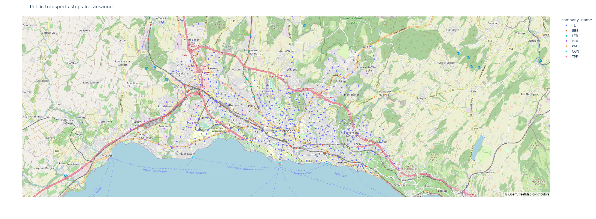
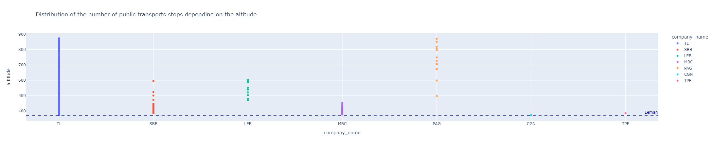
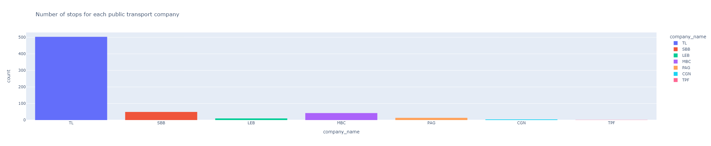
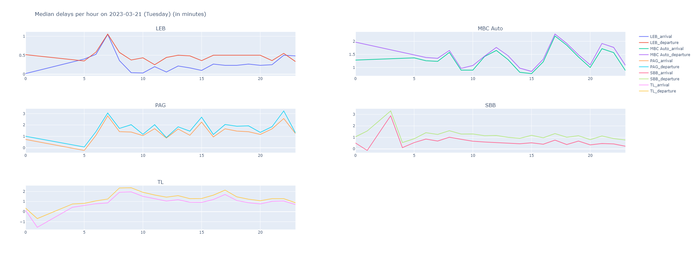
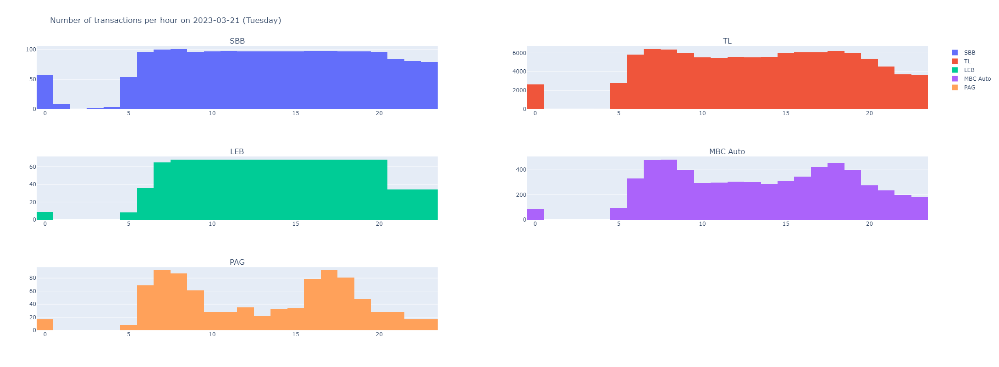
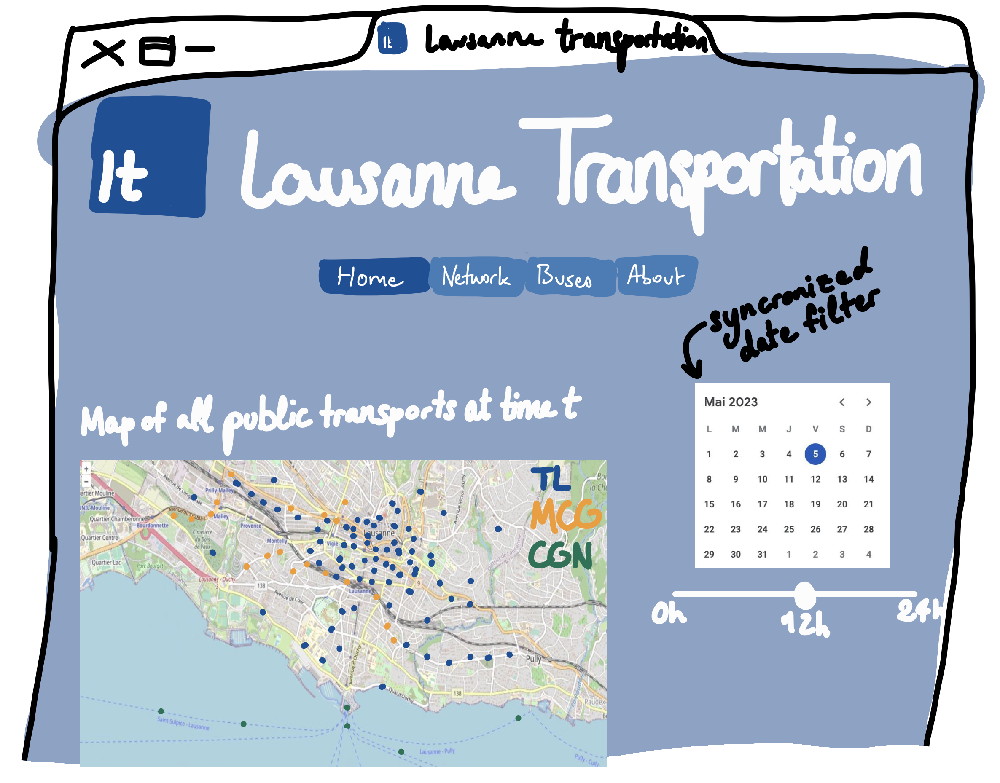
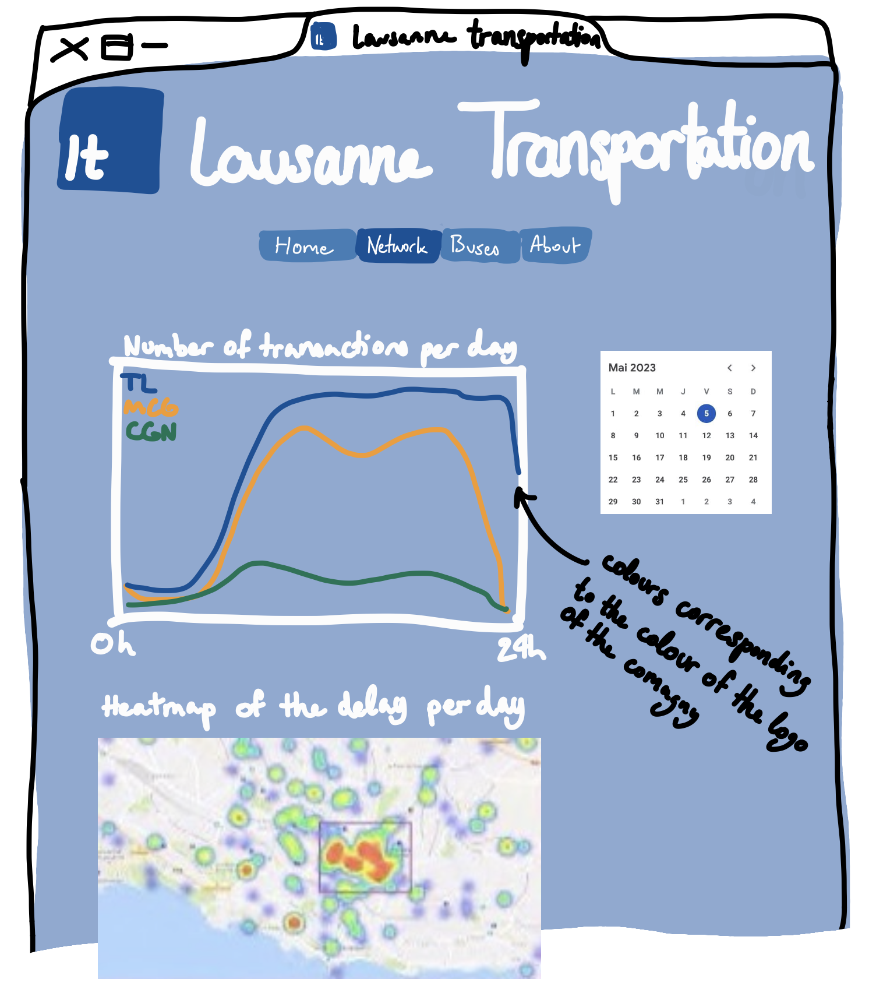
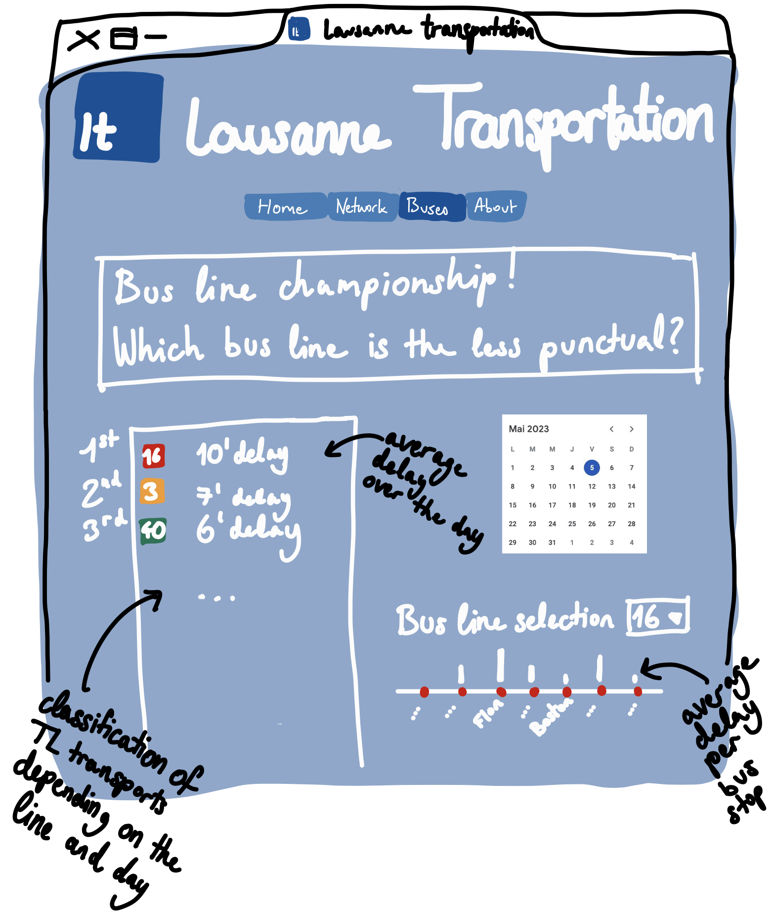

# Project of Data Visualization (COM-480)

| Student's name | SCIPER |
| -------------- | ------ |
| Lena Vogel | 297026 |
| Salma Ed-dahabi | 282284 |
| Antonin Faure | 302686 |

[Milestone 1](#milestone-1) • [Milestone 2](#milestone-2) • [Milestone 3](#milestone-3)

     <a href="https://com-480-data-visualization.github.io/project-2023-the-vizards/">Website</a>

## Milestone 1 (23rd April, 5pm)

**10% of the final grade**

This is a preliminary milestone to let you set up goals for your final project and assess the feasibility of your ideas.
Please, fill the following sections about your project.

*(max. 2000 characters per section)*

### Dataset

> Find a dataset (or multiple) that you will explore. Assess the quality of the data it contains and how much preprocessing / data-cleaning it will require before tackling visualization. We recommend using a standard dataset as this course is not about scraping nor data processing.
>
> Hint: some good pointers for finding quality publicly available datasets ([Google dataset search](https://datasetsearch.research.google.com/), [Kaggle](https://www.kaggle.com/datasets), [OpenSwissData](https://opendata.swiss/en/), [SNAP](https://snap.stanford.edu/data/) and [FiveThirtyEight](https://data.fivethirtyeight.com/)), you could use also the DataSets proposed by the ENAC (see the Announcements section on Zulip).

Our dataset is taken from [OpenTransportData.swiss](https://opentransportdata.swiss), a website storing data on all public transports in Switzerland. This real data provides the effective time at which a public transport transit by a stop and the plannified one at which it should have stopped. As the **[actual data](https://opentransportdata.swiss/de/ist-daten-archiv/)** is zipped by month we have decided to use data from 2022-01 to 2023-03 only, and to focus exclusively on Lausanne area. In addition, we use the **[stops data](https://opentransportdata.swiss/de/dataset/bav_liste)** so that we can have the latitude/longitude for each stop, and other useful data on it.

The documentation of the datasets can be found here: [actual data](https://opentransportdata.swiss/de/cookbook/ist-daten/) and [stops](https://opentransportdata.swiss/de/bav-haltestellen-liste/)

**Quick overview of the data:** For the timetables, the most useful columns are the time and date, the transport line, the transport ID, its type, theoretical and effective arrival and departure times, and more.

Concerning the stops data, the main features are the name of the stop, the transport company of the stop, its GPS coordinates, its altitude, its type of transport (bus, train, boat, ...) and others.

### Problematic

> Frame the general topic of your visualization and the main axis that you want to develop.
> - What am I trying to show with my visualization?
> - Think of an overview for the project, your motivation.

- Lausanne traffic depending on the day and moment:
    - What is the traffic at time t?
    - How usage of public transports varies depending on a given moment of the day or on which day of the week is considered?
    - Where and when delays happen?
- Lausanne connectivity through the city and its suburbs:
    - Are the suburbs well served? Are they reachable whitout too much difficulties at all moments of a day? Are there some specific hours with more or less availability?
    - To what extent is Lausanne network well connected? What are its weak and strong edges (which would be critical in case of disruption)?

> - Think of the target audience.

- The main target audience is people who would like to move to Lausanne in a near future.
- Another audience is the TL themselves, also for decision making purposes, for example helping to determine what are the main problematic areas, that could delay the buses. Finally, it could also be used by other experts such as geographists or sociologists to enable them to easily perform their analysis.

### Exploratory Data Analysis

> Pre-processing of the data set you chose
> 
As said previously, our work concentrate on the city of Lausanne. We had to filter the data depending on the coordinates in order to keep Lausanne data only. To do that, we first had to import all the data (of Switzeland) to be filtered. This has been very heavy on download (~15GO per month).

Moreover, in order to exploit the data, we have adapted the coordinates to latitude/longitude in the geocentric projection, because the data from https://opentransportdata.swiss is written in a format which is specific to Switzerland. More precisely, we needed to map geographic data for stops from LV95 coordinates format to WGS84 format. 

> - Show some basic statistics and get insights about the data

We have plotted graphs, with the public transport stops distribution, depending on their coordinates on a map, on the corresponding altitude, and on the company.

We have also plotted the delays during a period of 24hours for each transport company, and the number of transactions per day.

### Related work

> - What others have already done with the data?

There are some showcases of this datasets here: https://opentransportdata.swiss/de/showcase-5/

> - Why is your approach original?

We would like to concentrate our visualizations only on Lausanne, to allow any (or future) Lausanne residents to have access to a full view of the public transports network of the city.

> - What source of inspiration do you take? Visualizations that you found on other websites or magazines (might be unrelated to your data).

Other visualisations of that type have been done, for instance for Switzerland: https://observablehq.com/@alexmasselot/mapping-swiss-trains-delays-over-one-day/2, which shows the delays of the trains in Switzerland, and https://mobility.portal.geops.io/world.geops.transit?baselayer=world.geops, which displays most of the public transports in the world and their position in real time.

> - In case you are using a dataset that you have already explored in another context (ML or ADA course, semester project...), you are required to share the report of that work to outline the differences with the submission for this class.

It is not the case.

## Milestone 2 (7th May, 5pm)

**10% of the final grade**

### Introduction
For this second milestone, the task is to have a first skeleton of the website on public transports in Lausanne, as well as schemes to explain the design of the data visualisations we have chosen.
We have refined the choices of the plots we would like to show on our webstite, i.e a map of the positions of the buses and stops depending on the time of the day, graphs representing the usage of the different transport companies throughout the day, and other ones measuring their respective delay. We also changed our graphic chart to another one, inspired from the [TL](https://www.t-l.ch/). We created a new logo which is the inverse of the TL logo, see below:

Moreover, we changed the original simple frame of the website to another one, portionized between 4 tabs, all these figuring on the same website link:
- "Home": main map with all transports located at time t of day d, chosen through filters
- "Network": statistics over a day on transactions, delays and a heatmap on the average delays over a day (chosen through a filter)
- "Buses": fun page on the championship of buses: which bus line is the latest in average over a day (chosen through a filter), a ranking and a histogram of the average delay for the selected bus line
- "About": quick description of the project

The main addition since Milestone 1 is this idea of creating a new "fun" tab with an ironic championship of the bus lines which are the latest.

### Tools used
The most relevant lectures we use for our project are:

- Week 4 “Data” 
- Week 5 “Interactions”
- Week 6 “Perception colors” & “Mark,channels”
- Week 8 “Do and Don’t viz”
- Week 9 “Maps”
- Week 11 “Graphs” 

We used the Add-on ["ColorZilla"](https://chrome.google.com/webstore/detail/colorzilla/bhlhnicpbhignbdhedgjhgdocnmhomnp) to find the colors corresponding to the companies: #EB0000 for SBB, #005198 for TL, #5AB034 for LEB and #03A84B for MBC Auto.
We also used the software [Figma](https://www.figma.com/) to create the logo.

### Future add-ons 

If time permits, we might consider adding a visualization of the whole public transports as a connected graph, such as a force graph, in order to highlight the main edges of public transportation in Lausanne. The goal of this visualization would be to:
- easily identify the most used edges of the circuit
- interract with the graph by desactivating edges to see how the connectivity is impacted

We might add other funny features such as an evaluator of the average delay of the transports modeled by a smiley that would become happy or angry, or even the sound of the TL when opening the website and other guidance throughout the website such as showing the question that is being answered in each tab. 

### Overview of the website
Here are some sketches to show an overview of the website, with minimal text:

First tab:

Second tab:

Third tab:

The forth tab is self-explainatory

## Milestone 3 (4th June, 5pm)

**80% of the final grade**

### Process book
The process book explaining the whole reflection and intended usage of our website can be found on the GitHub, along with the final version of the website.

### Website
To open the website, go to "Github pages" and "View deploiment".

### Technical setup
To be able to run the files, you should have the .............. installed.

## Late policy

- < 24h: 80% of the grade for the milestone
- < 48h: 70% of the grade for the milestone

